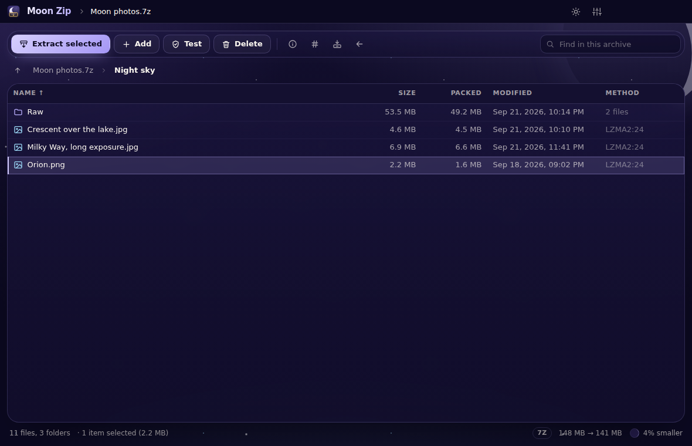
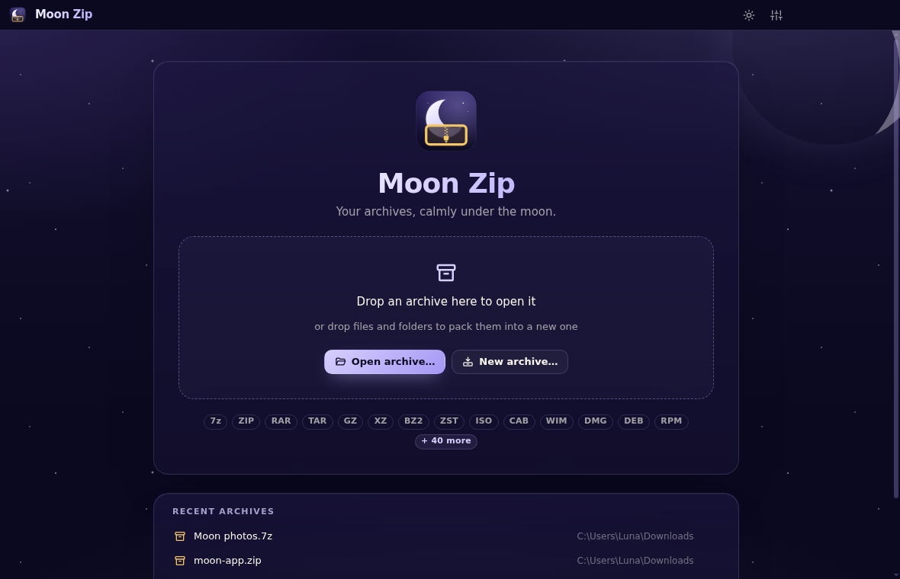
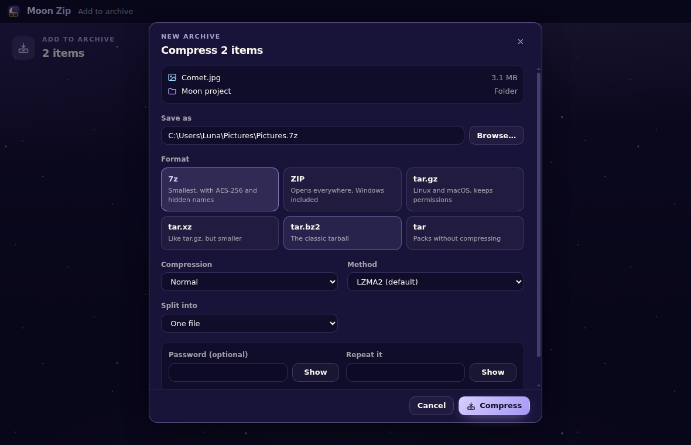
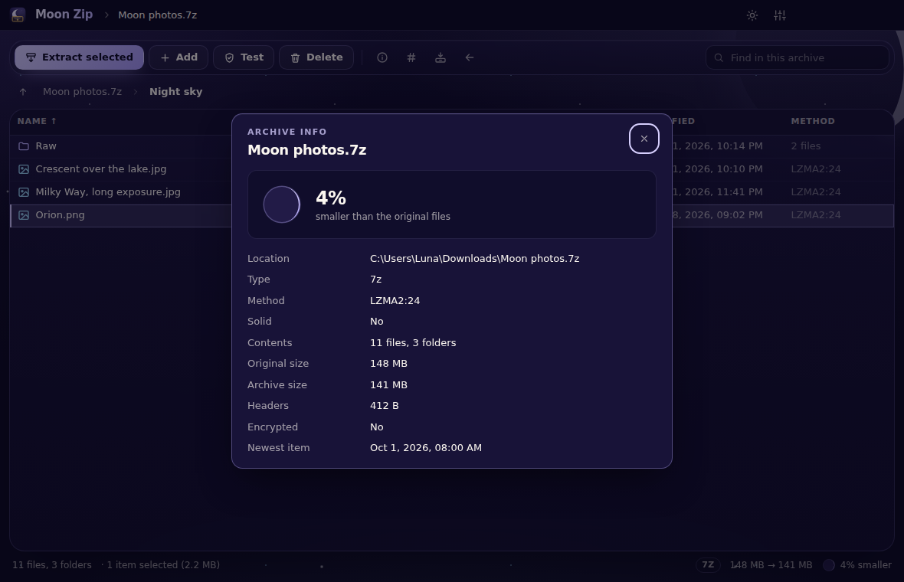
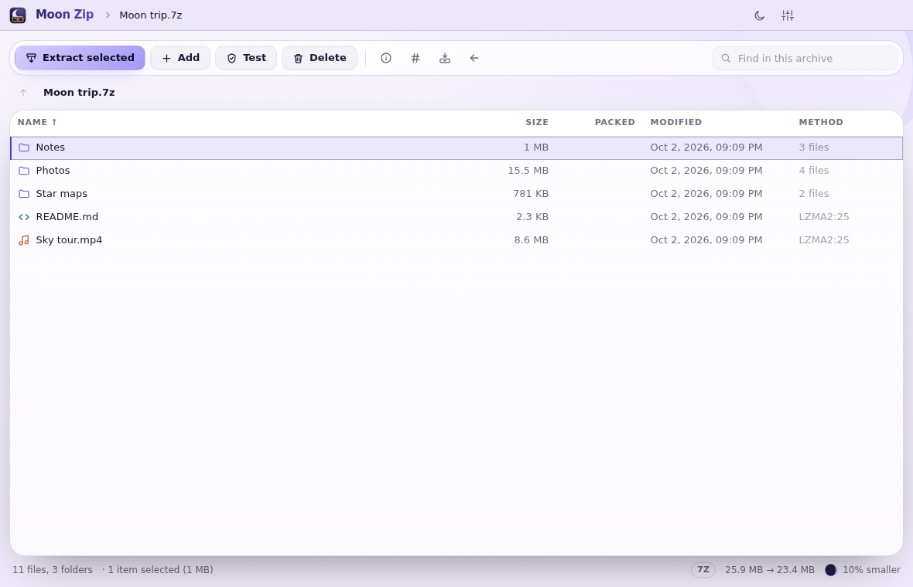
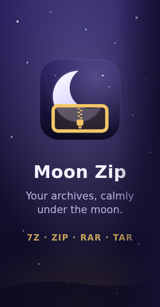

# Moon Zip

Moon Zip – your archives, calmly under the moon. An archive manager for Windows in the Luna-OS
"Moon" family (MoonDisk, MoonTask, Moon Browser, Moon Explorer), in the spirit of NanaZip: the
real 7-Zip inside, a calm night-sky app outside.



## What it does

- **Opens** 7z, ZIP, RAR, TAR, GZ, XZ, BZ2, ZST, ISO, CAB, WIM, DMG, DEB, RPM and 40 more formats
  (everything 7-Zip 26.03 reads), split archives (`.001`) included. A double-click on an archive
  inside an archive opens that one too.
- **Creates** 7z, ZIP, tar, tar.gz, tar.xz and tar.bz2, with six compression levels, the method of
  your choice, AES-256 passwords (7z can hide the file names too) and splitting into volumes.
- **Changes** 7z, ZIP, tar and WIM archives in place: add files (also by dropping them on the
  window, into the folder you're looking at), rename, delete. Archives of other types open
  read-only.
- **Extracts** everything or just the selection (without the folders around it), into a new folder
  named after the archive or anywhere else, with "keep both", "replace" or "skip" for files that
  exist already.
- **Tests** archives and works out **checksums** (CRC-32, MD5, SHA-1, SHA-256, SHA-512, BLAKE2b) of
  any file, with a field to paste the expected value into.
- **Finds** items anywhere in the archive as you type, sorts every column, and has the keyboard
  you expect: arrows, Enter, Backspace, Delete, F2, Ctrl+A.
- **Right-click menu** in Windows Explorer: "Extract with Moon Zip" on archives (Open, Extract here,
  Extract to new folder, Extract to…, Test archive) and "Compress with Moon Zip" on any file or folder
  (Add to archive…, Compress to .7z, Compress to .zip, Checksums…). Each runs in a small Moon window
  with the moon filling up as 7-Zip works. See [docs/shell-integration.md](docs/shell-integration.md).
- **Night and day** themes (or follow Windows), the same palette and components as the other Moon
  apps. See [docs/theme.md](docs/theme.md).

| Start page | Compress dialog |
| --- | --- |
|  |  |

| Archive info | Day theme |
| --- | --- |
|  |  |

## Run the desktop app

```sh
npm install
npm run fetch-7zip   # downloads the official 7-Zip 26.03 into vendor/7zip (checked by SHA-256)
npm run app          # build the UI and start the Electron app
npm run app:dev      # the same with the Vite dev server and hot reload
```

## Package it

```sh
npm run dist
```

This writes to `release/`:

- `Moon-Zip-Setup-<version>.exe`: the Windows installer (per user, no admin rights, Start menu and desktop shortcut)
- `Moon-Zip-<version>-win-x64.zip`: a portable build; unzip it and run `Moon Zip.exe`

The installer has the Moon look all the way through: the welcome and finish pages and the page
header are night-sky blue (`#141030`) with moon-white text, with a night-sky picture with the logo on
the welcome, finish and uninstall pages and the logo in the page header. Its last page offers
**Add Moon Zip to the right-click menu** (ticked by default); uninstalling takes the menu out again.
Its pages and colours are in `build/installer.nsh`.



`npm run icons` re-renders the app icons in `build/` from `public/moon-zip-logo.svg`, and the
installer pictures (`build/*.bmp`) from `build/installer/*.svg`.

### Release

Set the version in `package.json` (`npm version <x.y.z> --no-git-tag-version`), write the notes in
`docs/releases/v<x.y.z>.md`, merge, then push the tag `v<x.y.z>`, or start the Release workflow
by hand (Actions → Release → Run workflow on `main`), which creates the tag itself. The workflow
(`.github/workflows/release.yml`) fetches 7-Zip, checks and tests the code on Windows, builds the
installer and the ZIP, and publishes them as a GitHub release with those notes.

## Development

```sh
npm run dev        # the UI alone in a browser (http://localhost:1420), on an in-memory demo
npm run build      # typecheck + production build
npm test           # vitest (UI) and node --test (main process; the engine tests use the real 7-Zip)
npm run lint
```

How the pieces fit together:

- `electron/engine/` runs the bundled 7-Zip console tool (`7z.exe` + `7z.dll`): `args.cjs` builds
  its command lines, `listing.cjs` parses its output and progress, `engine.cjs` runs the jobs.
- `electron/shell-integration/` writes the right-click menu and "Open with" entries (per user).
- `electron/start.cjs` turns a command line (a double-clicked archive, a menu action) into a
  window; Explorer starts one process per selected file, and the first one gathers them.
- `src/` is the React UI; `src/lib/demo.ts` imitates the main process for the browser and the tests.

## 7-Zip

Moon Zip doesn't reimplement any archive format: it ships the official 7-Zip 26.03 console tool
(`7z.exe` and `7z.dll` from [7-zip.org](https://www.7-zip.org)) and talks to it. 7-Zip is
© Igor Pavlov and licensed under the GNU LGPL, with the unRAR restriction for the RAR code; its
license file is installed next to it (`resources\7zip\License.txt`). Moon Zip itself is MIT
licensed (see [LICENSE](LICENSE)).

## Language

The app UI and everything in this repository (code, identifiers, comments, tests, docs, commit
messages, pull requests) are in English, even when a request is written in another language. See
[CLAUDE.md](CLAUDE.md).
