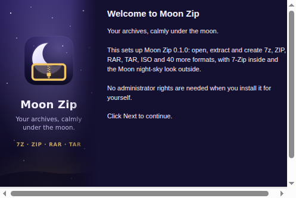

# The Moon theme

Moon Zip wears the same "night sky" look as the other Luna-OS Moon apps. It takes the theme
over from [Moon Explorer](https://github.com/Luna-OS/Moon-Explorer), which documents where each
value comes from (MoonDisk, MoonTask, Moon Browser) in its `docs/theme.md`.

**Source of truth in this repo:** [`src/theme/tokens.css`](../src/theme/tokens.css).

## What is shared, value for value

- the stack: React 19 + Vite + Tailwind CSS v4, configured CSS-first through `@theme`
- the `@theme` palette (`night-950 #0b0920`, `night-900 #141030`, `night-800 #1d1742`,
  `violet-700 #3b2e6b`, `lavender-400 #b9aefb`, `lavender-300 #d6cffd`, `moon-100 #f4f1ff`,
  `mint-400 #7fe3c6`, `sky-300 #9ad7f5`, `peach-300 #f7b89a`, `cream-100 #fbf7f0`,
  `warning-400 #f3c766`, `error-500 #e5626b`)
- the two-layer token model: the raw palette plus semantic variables, here with Moon Zip's
  `mz` prefix (`--mz-bg`, `--mz-text`, `--mz-accent`, … – the same names as `--me-*`, `--mb-*`, `--mt-*`)
- night as the default, the day theme through `<html data-theme="light">`, and "follow the system"
- the decorative sky (two star layers, the crescent in the top-right corner, no twinkling), the
  glass surfaces, the lavender gradient title, the MoonPhase gauge and the 2px round-stroke icons
- the components `.mz-glass`, `.mz-popover`, `.mz-inset`, `.mz-title`, `.mz-eyebrow`, `.mz-btn`
  (+ `-primary`, `-ghost`, `-danger`, `-sm`, `-icon`), `.mz-icon-btn`, `.mz-input`, `.mz-crumb`,
  `.mz-chip`, `.mz-table`, `.mz-meter`, `.mz-switch`, `.mz-kbd`, `.mz-titlebar`, `.mz-menu-item`
- the 40px custom title bar of a frameless window, with the native window buttons coloured to
  match (`FRAME_COLORS` in `src/theme/frame-colors.ts`)

## New in Moon Zip

| Piece | What it is |
| --- | --- |
| `.mz-drop` | The dashed drop target on the start page and over an open archive. It lights up lavender while files are dragged in. |
| `.mz-option` | A radio card with a title and a hint: archive format, "when a file exists already", theme. |
| `.mz-label`, `.mz-checkbox` | Form labels and lavender checkboxes for the dialogs. |
| MoonPhase as progress | The moon fills up while 7-Zip works (`src/app/ProgressCard.tsx`), and shows how much smaller an archive is than its files (status bar, Archive info). |
| The logo | The Moon app tile (night gradient, crescent, stars) with Moon Zip's mark: a golden archive box with a zipper, in `warning-400 #f3c766` – the colour archives have in Moon Explorer's file list. |

File kinds in the list use `--mz-kind-{folder,image,media,code,archive,file}`, exactly as in
Moon Explorer.

## The installer

The NSIS installer is themed too (`build/installer.nsh`, pictures from `build/installer/*.svg`):

- `MUI_BGCOLOR 141030` (`night-900`) and `MUI_TEXTCOLOR F4F1FF` (`moon-100`) make the welcome
  and finish pages and the page header night-coloured with moon-white text.
- The list of installed files is moon-white on night (`MUI_INSTFILESPAGE_COLORS`).
- The welcome/finish picture (164 × 314) is the night sky with the logo, the name and
  "Your archives, calmly under the moon."; its right edge fades into `#141030`, so it runs on
  into the page. The uninstaller has its own ("Thanks for packing under the moon.").
- The header picture (150 × 57) starts in exactly `#141030` on the left and carries the logo.

*(A mock-up built from the same picture and colours, not a screenshot of the real installer.)*
